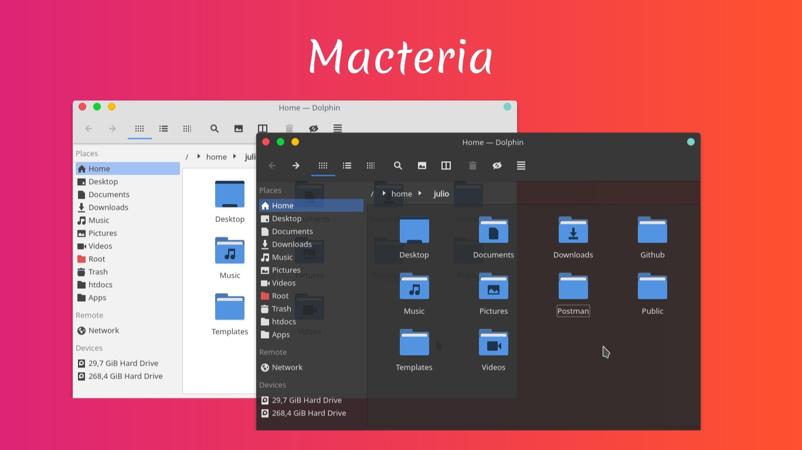

  

Tema aurorae que imita a decoração de janelas do OS X inspirado nos padrões de cores do tema [Materia](https://github.com/PapirusDevelopmentTeam/materia-kde).  

### Instalação
`wget -qO- https://raw.githubusercontent.com/jcmljunior/macteria/master/install.sh | bash`

### Licença
O Macteria é distribuido sob os termos de licença GNU General Public License versão 3.  
Consulte o arquivo de [`LICENÇA`](LICENSE) para mais detalhes.